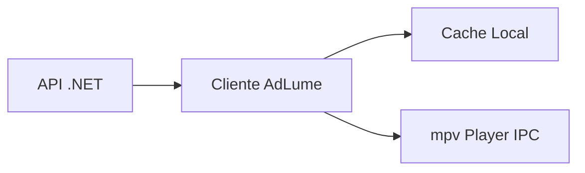
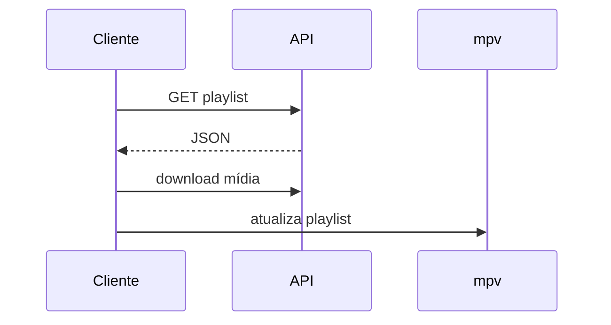

# 🚀 AdLume


Sistema de reprodução de mídia com controle remoto via API, sincronização offline e integração com player leve.

---

## 📖 Visão Geral

O **AdLume** é um sistema projetado para distribuição e execução de playlists de mídia em dispositivos remotos.

- Offline-first  
- Baixo consumo de recursos  
- Controle centralizado via API  
- Execução headless com mpv  

---

## 🧱 Arquitetura



---

## 🧩 Componentes

### 🔹 API (.NET)
- Fornece playlists por dispositivo
- Serve arquivos de mídia
- Protegida via Bearer Token

### 🔹 Cliente

Compatível com **Windows e Linux**, utilizando .NET 8.

- Consome API
- Faz cache local (JSON)
- Sincroniza mídias
- Controla player via socket IPC

### 🌍 Compatibilidade

- Windows
- Linux

Requisitos:
- .NET 8 Runtime
- mpv instalado

---

## 🔐 Autenticação

```http
Authorization: Bearer SEU_TOKEN
```

Validação atual: simples (token fixo).

---

## 🌐 Endpoints

### GET /equipamento/{deviceId}

Retorna playlist.

### GET /media/{nomeMidia}

Retorna arquivo mp4.

---

## 📥 Sync de mídia

- Cria /Videos
- Baixa apenas novos arquivos
- Usa streaming (baixo uso de memória)

---

## 🎥 Player

```bash
mpv --idle=yes --no-terminal --input-ipc-server=/tmp/mpvsocket
```

---

## 🎮 IPC

```json
{ "command": ["loadfile", "video1.mp4", "replace"] }
```

---

## 📡 Fluxo



---

## 🚀 Roadmap

- JWT completo  
- Retry  
- Paralelismo  
- Hash check  
- Docker  

---

## 📦 Stack

- .NET 8  
- Serilog  
- mpv  

---

## 📄 Licença

Privado.
